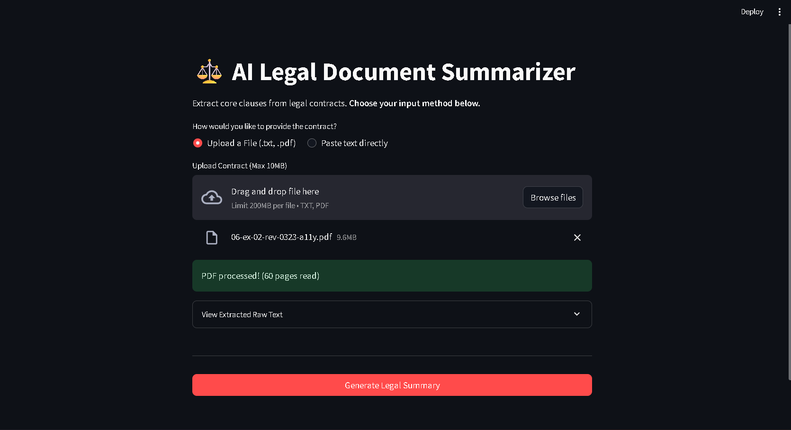

# ⚖️ LegalTech AI Summarizer

An enterprise-grade, full-stack AI web application that automatically extracts key clauses, parties, and financial penalties from complex legal contracts and NDAs using Google's state-of-the-art Gemini 2.5 Flash model.


---

## 📸 App Preview



---

---

## 🚀 Features

* **Dual-Input Processing:** Users can either upload raw files (`.pdf`, `.txt`) or paste legal text directly into the UI.
* **Zero-Hallucination Prompt Engineering:** The LLM is strictly constrained via `temperature=0.1` and injected system prompts to prevent it from generating fake legal advice or hallucinating missing clauses.
* **Document Safety & Parsing:** Built-in safeguards reject files over 5MB and cap PDF extraction at 50 pages to optimize API usage and protect system memory.
* **Secure Secrets Management:** Integrates `python-dotenv` to ensure API keys remain entirely out of the source code.
* **Rapid UI:** Built with Streamlit for a clean, responsive, and intuitive user experience.

---

## 🛠️ Tech Stack

* **Frontend & Server:** [Streamlit](https://streamlit.io/)
* **AI Engine:** Google Generative AI (`gemini-2.5-flash`)
* **Document Parsing:** `PyPDF2`
* **Environment Management:** `python-dotenv`

---

## 💻 Local Installation & Setup


If you want to run this application locally, follow these steps:

**1. Clone the repository**
```bash
git clone [https://github.com/doz6x9/LegalTech-AI-Summarizer.git](https://github.com/YourUsername/LegalTech-AI-Summarizer.git)
cd LegalTech-AI-Summarizer
```

**2. Install Dependencies**
```bash
pip install -r requirements.txt
```

**3.Set up your Environment Variables (.env)**
To keep your API keys secure, this project uses an environment file that is ignored by Git.

Create a file named .env in the root directory.

Add your Gemini API key from Google AI Studio as follows (no quotes):

```bash
GEMINI_API_KEY=your_actual_google_api_key_here
```
**4. Run the Application**
Launch the Streamlit server to view the app in your browser:

```bash
python -m streamlit run app.py

```


